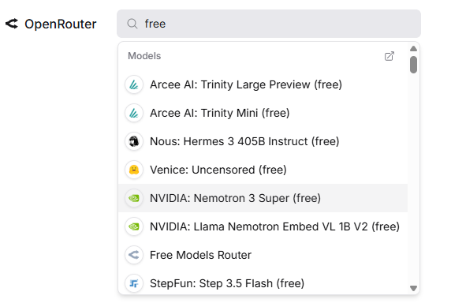

# OpenClaw School 1차시 — 나의 AI 비서와 인사하기

## 차시 개요

- **주제:** 내 생애 첫 AI 비서와의 만남 - 오픈클로(OpenClaw) 시작하기
- **핵심 키워드:** Onboarding, AI Greeting, OpenClaw Ecosystem, First Connection
- **목표:** 오픈클로를 통해 나만의 AI 비서를 깨우고, 첫 인사를 나누며 에이전트 시대의 주인공이 된다.

---

## 강의 목표

나만의 첫 번째 AI 비서를 깨우기 위해 필요한 **오픈클로(OpenClaw) 설치부터 메신저 연동까지**의 전체 구조를 학습하고, 실제 비서와 첫 인사를 나눈다.

## 학습 목표

- AI 에이전트의 개념과 흐름(GPT → Copilot → Agent)을 이해한다.
- 나의 명령을 수행할 오픈클로의 3대 핵심 구조를 이해한다.
- GCP 서버에 오픈클로를 설치하여 비서의 '몸체'를 마련할 수 있다.
- Telegram, Discord 등 메신저 채널을 통해 비서와 대화를 시작할 수 있다.
- GitHub 저장소를 생성하여 비서와 함께 성장할 기록 공간을 만든다.

---

## 준비물

> ⚠️ **수업 전에 미리 준비해 주세요!**

| 준비물 | 설명 | 준비 방법 |
|--------|------|-----------|
| **GitHub 계정** | 에이전트 프로젝트를 저장·관리할 공간 | [github.com](https://github.com) 에서 무료 가입 |
| **OpenClaw 실행 환경** | 에이전트를 실행할 서버 환경 | 강사가 GCP 인스턴스를 제공하거나, 로컬 PC에서 설치 |
| **Maton API 사용 정보** | 에이전트 기능 확장에 사용할 API | 수업 시간에 API Key를 안내 |
| **인터넷 연결** | 모든 실습에 필요 | Wi-Fi 또는 유선 연결 |

---

## 주요 내용

### 1. AI 에이전트 시대 이해

#### 💡 AI 에이전트란?

AI 에이전트는 단순히 질문에 답하는 챗봇이 아니라, **스스로 판단하고 행동까지 수행하는 AI 시스템**이다.

| 구분 | 챗봇 (예: ChatGPT) | AI 에이전트 (예: OpenClaw) |
|------|---------------------|-------------|
| **출시 시기** | 2022년 11월 | 2026년 1월 |
| **하는 일** | 질문에 답변 | 질문에 답변 + 직접 작업 수행 |
| **예시** | "이메일 초안 써줘" → 텍스트 출력 | "이메일 보내줘" → 실제로 이메일 전송 |
| **특징** | 사람이 복사·붙여넣기 해야 함 | 에이전트가 알아서 실행 |

#### AI의 발전 흐름

```
GPT (질문-답변) → Copilot (작업 보조) → Agent (자율 실행)
```

- **사람이 AI를 사용하는 시대** → **AI를 고용하는 시대**로 변화
- 전문가 에이전트는 특정 분야의 지식을 갖고, 해당 분야 업무를 자동으로 처리

#### 전문가 에이전트가 중요한 이유

일반 AI는 모든 분야를 "조금씩" 알지만, 전문가 에이전트는 **한 분야를 깊게** 안다.

| 구분 | 일반 AI (범용) | 전문가 에이전트 |
|------|----------------|-----------------|
| **지식 범위** | 넓고 얕음 | 좁고 깊음 |
| **응답 품질** | 보통 수준 | 전문가 수준 |
| **실제 사례** | "마케팅이 뭔지 알려줘" | "우리 제품의 3월 인스타그램 광고 카피 5개 만들어줘" |
| **경쟁력** | 누구나 만들 수 있음 | 도메인 전문 지식이 차별화 요소 |

> **💡 핵심 인사이트:** 앞으로는 "AI를 잘 쓰는 사람"이 아니라, **"자기 분야의 전문가 에이전트를 만든 사람"**이 경쟁력을 가진다.

#### 전문가 에이전트 활용 사례

| 분야 | 에이전트 역할 | 구체적 활용 |
|------|---------------|-------------|
| **영어 교육** | 1:1 맞춤형 영어 튜터 | 학생 수준에 맞는 문제 출제, 오답 분석, 발음 가이드 |
| **마케팅** | 콘텐츠 제작 어시스턴트 | SNS 카피 생성, A/B 테스트 문구 작성, 트렌드 분석 |
| **부동산** | 매물 분석 비서 | 시세 비교, 투자 수익률 계산, 계약서 검토 포인트 정리 |
| **헬스케어** | 건강 관리 코치 | 식단 추천, 운동 루틴 생성, 건강 지표 모니터링 |
| **법률** | 법률 문서 검토 보조 | 계약서 핵심 조항 요약, 리스크 포인트 표시, 판례 검색 |
| **콘텐츠 제작** | 영상 기획 어시스턴트 | 대본 초안 작성, 썸네일 문구 생성, 업로드 일정 관리 |

#### 강사 멘트 예시

> "이제 중요한 것은 AI가 답변을 잘하는가가 아니라, 실제로 일을 처리할 수 있는가입니다. 오늘 수업은 그 출발점인 실행 환경을 만드는 시간입니다."

---

### 2. OpenClaw 실행 실습

#### 🔨 실습: OpenClaw 설치 및 첫 실행

**Step 1. 서버 접속 프로그램(MobaXterm) 설치 및 GCP 접속** (강사가 제공하는 서버를 사용하는 경우)

원격 서버에 쉽게 접속하기 위해 무료 SSH 클라이언트인 MobaXterm을 사용합니다. (Windows 환경 권장)

1. [MobaXterm 공식 웹사이트](https://mobaxterm.mobatek.net/download.html)에 접속하여 **Home Edition (Installer edition)**을 다운로드하고 설치합니다.
2. MobaXterm을 실행한 뒤, 상단의 **Session** ➡️ **SSH**를 클릭합니다.
3. 접속 정보(강사가 제공한 IP 주소 및 사용자명)를 입력하고, **Advanced SSH settings** 탭에서 **Use private key**를 체크한 뒤 강사가 제공한 `key.pem` 파일을 선택하여 접속합니다.

> **💡 TIP:** Mac 사용자라면 별도 프로그램 설치 없이 기본 터미널(Terminal) 앱을 열고 아래 명령어로 바로 접속할 수 있습니다.
> ```bash
> ssh -i key.pem user@[서버IP주소]
> ```


### 3. OpenClaw 구조 이해

> **💡 이 섹션의 목적:** 앞에서 직접 실행해 본 OpenClaw가 내부적으로 어떻게 동작하는지 이해한다. 구조를 알면 에러가 날 때 어디를 확인해야 하는지 알 수 있다.

#### OpenClaw란?

OpenClaw는 **AI 에이전트를 만들고 실행할 수 있는 오픈소스 플랫폼**이다. 단순한 챗봇 도구가 아니라, 브라우저와 연결되어 실제 액션을 수행할 수 있는 실행 환경이다.

#### OpenClaw의 핵심 구성 요소

```
┌─────────────────────────────────────────────┐
│                  OpenClaw                   │
│                                             │
│  ┌───────────┐  ┌────────────────────────┐  │
│  │  Gateway   │  │   Browser Relay        │  │
│  │ (명령 수신) │  │ (브라우저 자동화 실행)  │  │
│  └─────┬─────┘  └───────────┬────────────┘  │
│        │                    │               │
│        └────────┬───────────┘               │
│                 ▼                           │
│        ┌──────────────┐                     │
│        │  Agent Core  │                     │
│        │ (에이전트 로직)│                     │
│        └──────────────┘                     │
└─────────────────────────────────────────────┘
```

| 구성 요소 | 역할 | 쉬운 비유 |
|-----------|------|-----------|
| **Gateway** | 외부 메시지(Telegram, Discord 등)를 받아서 에이전트에게 전달 | 회사의 안내 데스크 |
| **Browser Relay** | 에이전트가 웹 브라우저를 조작할 수 있게 해주는 연결 장치 | 에이전트의 손 |
| **Agent Core** | 실제로 생각하고 판단하는 에이전트의 두뇌 | 직원의 머리 |

#### OpenClaw 동작 흐름

```
사용자가 Telegram에서 메시지 전송
  → Gateway가 메시지를 수신
    → Agent Core가 메시지를 분석하고 판단
      → 필요 시 Browser Relay로 웹 작업 수행
        → 결과를 사용자에게 응답
```

#### OpenClaw vs 다른 에이전트 플랫폼 비교

| 특징 | OpenClaw | LangChain |
|------|----------|-----------|
| **설치 방식** | 서버 1대에 간단 설치 | 라이브러리 (코딩 필요) |
| **메신저 연동** | Telegram, Discord, WhatsApp 기본 지원 | 직접 구현 |
| **브라우저 자동화** | 내장 (Browser Relay) | 별도 구현 |
| **난이도** | ⭐⭐ (초보자 친화) | ⭐⭐⭐⭐ (개발자 대상) |
| **비용** | 오픈소스 무료 | 오픈소스 무료 |

#### 강사 멘트 예시

> "OpenClaw는 단순한 챗봇 도구가 아니라, 브라우저와 연결되어 실제 액션을 수행할 수 있는 실행 환경입니다. 다른 플랫폼에 비해 비개발자도 쉽게 시작할 수 있다는 것이 큰 장점입니다."

---

### 4. OpenRouter 소개 및 활용

#### 💡 OpenRouter란? ([https://openrouter.ai](https://openrouter.ai))

OpenRouter는 **전 세계의 다양한 AI 모델(LLM)을 하나의 API로 사용할 수 있게 해주는 통합 플랫폼**이다. 에이전트의 '두뇌' 역할을 할 AI 모델을 쉽고 저렴하게 선택할 수 있다.

```text
에이전트 ──(OpenRouter API)──▶ GPT-4 / Claude 3 / Llama 3 등 다양한 AI 모델
```

**현실 비유:** 대형 마트의 인재 파견소와 같다.
- 어떤 모델(알바생)이 필요한지에 따라 여러 AI 모델을 쉽게 고용할 수 있다.

#### 왜 OpenRouter를 써야 할까?

| 특징 | 개별 API (OpenAI 등 각각 연동) | OpenRouter 사용 |
|------|--------------------------------|-----------------|
| **비용** | 서비스마다 따로 결제, 관리 | 한 곳에서 일정 금액 충전 후 여러 모델 사용 |
| **코드 수정** | 모델마다 연결 방식을 바꿔야 함 | 거 동일한 코드로 모델 이름만 바꾸면 교체됨 |
| **다양성** | 특정 회사의 모델에만 종속됨 | 전 세계 수백 개의 무료/유료 최신 모델 사용 |

#### 🔨 실습: OpenRouter API 키 발급받기

**Step 1. OpenRouter 가입**
1. [openrouter.ai](https://openrouter.ai) 접속
2. GitHub 계정 또는 Google 계정으로 간편 로그인

**Step 2. API Key 발급**
1. 메뉴에서 **"Keys"** 클릭
2. **"Create Key"** 버튼 클릭
3. **생성된 키 복사하여 안전한 곳에 보관** (보안상 화면에서 다시 볼 수 없으므로 반드시 메모!)

> **💡 TIP:** 실습 환경에 따라 강사가 발급한 통합 키를 제공할 수도 있습니다. 이런 경우 가입 방법만 가볍게 살펴보고 넘어갑니다.

#### 강사 멘트 예시

> "OpenClaw라는 몸체를 만들었다면, 이제 상황에 맞는 똑똑한 두뇌를 연결해야 합니다. OpenRouter는 우리가 필요할 때마다 가장 적합하고 저렴한 AI 두뇌를 쉽게 불러올 수 있게 해주는 마법 같은 도구입니다."

---

**Step 3. OpenClaw 온보딩 마법사 실행하기**

에이전트를 백그라운드에서 항상 켜두고 시스템 환경을 자동으로 설정하기 위해 온보딩 마법사를 실행합니다.

```bash
openclaw onboard --install-daemon
```

- 위 명령어를 입력하면 에이전트 초기 설정이 진행되며, 시스템 서비스(데몬)로 등록해 컴퓨터나 서버가 켜질 때마다 에이전트가 자동 실행되도록 구성합니다.
- 화면에 나타나는 안내에 따라 진행해 주세요.

---

**Step 4. 에이전트에 AI 모델(두뇌) 연결 및 변경하기**

OpenClaw 설정 화면을 통해 발급받은 API 키를 등록하고, 사용할 AI 모델을 추가하거나 변경할 수 있습니다.

```bash
openclaw configure --section model
```

- 터미널(또는 SSH 접속 화면)에 위 명령어를 입력하면, 사용할 LLM 모델을 설정하는 화면이 나타납니다.
- 안내에 따라 발급받은 OpenRouter API 키를 입력하고, 원하는 모델(예: `openai/gpt-4o-mini`, `anthropic/claude-3-haiku` 등)을 **추가**하거나 기존 모델을 다른 모델로 쉽게 **변경**할 수 있습니다.



> **💡 TIP: 무료 모델 활용하기**
> OpenRouter에는 별도의 비용 없이 무료로 사용할 수 있는 수준 높은 모델(Free 표기)들이 다양하게 제공됩니다.
> 처음 실습할 때는 무료 모델(예: `google/gemini-2.0-flash-lite-preview-02-05:free` 등)을 추가해서 비용 부담 없이 넉넉하게 테스트해 보는 것을 추천합니다!

---

**Step 5. 메신저 채널(Telegram) 연결하기** ([https://telegram.org/](https://telegram.org/))

사용자가 에이전트와 대화를 나눌 수 있도록 Telegram 봇을 생성하고 연결합니다.

```bash
openclaw configure --section channels
```

- 위 명령어를 입력하면 에이전트와 연결할 채널을 설정하는 메뉴가 나타납니다.
- `telegram`을 선택한 뒤, BotFather를 통해 발급받은 **Telegram Bot Token**을 입력하면 에이전트와 텔레그램 메신저가 연결됩니다.
- 설정이 완료되면 텔레그램에서 봇에게 메시지를 보내 에이전트가 정상적으로 응답하는지 확인합니다.

---

**Step 6. 웹 검색 기능(Brave Search API) 연결하기** ([https://brave.com/search/api/](https://brave.com/search/api/))

에이전트가 최신 정보를 검색하고 인터넷의 데이터를 활용할 수 있도록 웹 검색 API를 연결합니다.

```bash
openclaw configure --section web
```

- 위 명령어를 입력하면 에이전트의 검색 엔진을 설정하는 화면이 나타납니다.
- `BraveSearch`를 선택한 뒤, 기본적으로 제공되는 무료 API 키를 이용하거나 직접 발급받은 **Brave Search API Key**를 입력합니다.
- 설정이 완료되면 에이전트가 명령을 수행할 때 필요에 따라 스스로 웹 검색을 진행하여 더욱 정확한 답변을 제공할 수 있게 됩니다.

---

### 5. Maton API 활용

#### 💡 Maton API란? ([https://maton.ai](https://maton.ai))

Maton API는 **에이전트가 지메일, 구글 캘린더 같은 외부 서비스를 쉽게 연동할 수 있도록 도와주는 도구**이다. 복잡한 인증이나 코드 작성 없이, 간단한 설정만으로 다양한 서비스를 에이전트에 연결할 수 있다.

```
에이전트 ──(Maton API)──▶ 지메일 / 구글캘린더 / 기타 서비스
```

**현실 비유:** 만능 어댑터와 비슷하다.
- 에이전트(전자제품)와 외부 서비스(콘센트)를 연결해주는 변환 플러그 역할

#### Maton API 주요 연동 서비스

| 연동 서비스 | 에이전트가 할 수 있는 일 | 활용 예시 |
|-------------|--------------------------|-----------|
| **Gmail** | 이메일 읽기, 보내기, 검색 | "오늘 온 중요 메일 요약해줘" |
| **Google Calendar** | 일정 조회, 등록, 수정 | "내일 오후 3시에 미팅 잡아줘" |
| **Google Sheets** | 데이터 읽기, 쓰기 | "이번 달 매출 데이터 정리해줘" |
| **Slack / Discord** | 메시지 전송, 알림 | "팀 채널에 주간 보고 보내줘" |

> **💡 핵심:** Maton API가 없으면 각 서비스마다 복잡한 인증 코드를 직접 작성해야 한다. Maton API를 쓰면 이 과정이 **클릭 몇 번**으로 줄어든다.

#### Maton API를 쓰면 뭐가 달라지나?

```
❌ Maton API 없이 지메일 연동하는 경우:
   1. Google Cloud Console 프로젝트 생성
   2. OAuth 2.0 인증 정보 설정
   3. Gmail API 활성화
   4. 인증 토큰 코드 작성 (약 50줄)
   5. 이메일 전송 코드 작성 (약 30줄)
   → 총 소요 시간: 약 2~3시간 + 디버깅

✅ Maton API로 지메일 연동하는 경우:
   1. Maton 대시보드에서 Gmail 연동 클릭
   2. Google 계정 로그인
   3. 완료!
   → 총 소요 시간: 약 3분
```

#### 🔨 실습: Maton API로 구글 캘린더 연동하기

**Step 1. Maton 대시보드 접속**

1. Maton 대시보드에 접속 (강사가 URL 안내)
2. 회원가입 또는 로그인

**Step 2. 연동 서비스 추가**

1. 대시보드에서 **"서비스 연동"** 메뉴 클릭
2. **Google Calendar** 선택
3. Google 계정 로그인 및 권한 허용
4. 연동 완료 확인 ✅

**Step 3. 에이전트에서 테스트**

에이전트에게 아래와 같이 말해본다:

```
"내일 일정 알려줘"
"3월 15일 오후 2시에 '오픈클로스쿨 3차시' 일정 추가해줘"
"이번 주 비어있는 시간 찾아줘"
```

> **💡 TIP:** 처음에는 구글 캘린더 연동부터 시작하는 것을 추천한다. 눈에 보이는 결과(일정 추가)가 바로 확인되므로 성취감이 크다.

#### 📌 Maton API 활용 아이디어

에이전트 분야별로 어떤 서비스를 연동하면 좋을지 생각해보자:

| 전문가 에이전트 | 연동하면 좋은 서비스 | 자동화 시나리오 |
|-----------------|----------------------|-----------------|
| 영어 교육 에이전트 | Google Calendar + Sheets | 수업 일정 자동 등록, 학습 진도 기록 |
| 마케팅 에이전트 | Gmail + Slack | 경쟁사 뉴스 요약 → 팀 채널에 공유 |
| 업무 비서 에이전트 | Calendar + Gmail | 오늘 일정 요약 메일 매일 아침 전송 |
| 고객 상담 에이전트 | Sheets + Discord | 문의 내역 자동 기록, 미답변 알림 |

#### 강사 멘트 예시

> "좋은 에이전트는 혼자 일하지 않습니다. Maton API를 통해 지메일, 캘린더 같은 서비스와 연결되면 진짜 비서처럼 일할 수 있습니다."

---

### 6. GitHub 활용

#### 💡 GitHub가 뭔가요?

GitHub는 **코드와 파일의 변경 이력을 관리하는 온라인 저장소**이다. 에이전트 개발에서 GitHub가 필요한 이유:

- 프롬프트를 수정할 때마다 이전 버전을 보관할 수 있다
- 다른 사람과 에이전트 프로젝트를 함께 작업할 수 있다
- 잘 만든 에이전트 템플릿을 공유할 수 있다

#### 왜 마지막에 GitHub를 배우나?

```
1차시 → 2차시 → 3차시 → 4차시
 ↓        ↓        ↓        ↓
설치     지식구축    개발    상품화
 └────────┴─────────┴────────┘
      매 차시마다 GitHub에 저장!
```

GitHub는 **매 차시 결과물을 저장하는 포트폴리오**가 된다. 4차시가 끝나면 GitHub 저장소 하나에 여러분의 에이전트 프로젝트 전체가 담겨 있게 된다.

#### 핵심 용어 정리

| 용어 | 뜻 | 쉬운 비유 |
|------|-----|-----------|
| **Repository (저장소)** | 프로젝트 파일을 담는 폴더 | 프로젝트 바인더 |
| **Clone (클론)** | 원격 저장소를 내 컴퓨터로 통째로 복사해오기 | 가게 체인점 내기 |
| **Commit (커밋)** | 변경 사항을 저장하는 것 | "저장" 버튼 누르기 |
| **Push (푸시)** | 내 컴퓨터의 변경 사항을 GitHub에 올리기 | 클라우드에 업로드 |
| **Pull (풀)** | 도구 저장소(GitHub)의 최신 내용을 내 컴퓨터로 가져오기 | 최신 업데이트 다운로드 |
| **Branch (브랜치)** | 원본을 건드리지 않고 작업할 수 있는 독립된 공간 | 평행 세계 만들기 |
| **Pull Request (PR)** | 내가 작업한 내용을 원본에 반영해달라고 요청하기 | 결재 대기 서류 제출 |
| **README.md** | 프로젝트의 얼굴이자 소개 문서 | 프로젝트 표지 |

#### 🔨 실습: GitHub 저장소 만들기

**Step 1. GitHub 가입** (이미 가입했다면 건너뛰기)

1. [github.com](https://github.com) 에 접속
2. 우측 상단 **Sign up** 클릭
3. 이메일, 비밀번호, 사용자 이름 입력 후 가입 완료

**Step 2. 저장소 가져오기 및 파일 동기화** (Clone/Commit/Push/Pull)

이제 터미널(Git Bash 또는 명령 프롬프트)을 열고 아래 명령어를 통해 프로젝트를 관리해 봅니다.

1. **저장소 복제 (Clone):** 클라우드에 있는 프로젝트를 내 컴퓨터로 가져옵니다.
   ```bash
   git clone https://github.com/OpenClawSchool/OpenClaw-101.git
   cd OpenClaw-101
   ```

2. **작업 내용 저장 (Commit):** 내 컴퓨터에서 수정한 내용을 로컬 기록에 남깁니다.
   ```bash
   # 파일 수정 후
   git add .
   git commit -m "나의 첫 번째 에이전트 지식 문서 추가"
   ```

3. **서버에 업로드 (Push):** 내 컴퓨터의 기록을 GitHub 서버로 보냅니다.
   ```bash
   git push origin main
   ```

4. **서버에서 다운로드 (Pull):** 다른 사람이나 서버에서 변경된 내용을 내 컴퓨터로 가져옵니다.
   ```bash
   git pull origin main
   ```


#### 강사 멘트 예시

> "에이전트도 결국 제품입니다. 제품은 기록되고 버전 관리되어야 하므로 GitHub는 선택이 아니라 기본입니다."

---

### 7. 마크다운(Markdown) 기초 및 표준 포맷

에이전트의 지식을 구성하고 정리할 때 기본이 되는 마크다운 문법과 본 과정의 표준 문서 포맷을 익힙니다.

#### 💡 마크다운 기본 문법 (Cheat Sheet)

| 기능 | 문법 | 결과 예시 |
| :--- | :--- | :--- |
| **제목** | `# 제목 1` ~ `### 제목 3` | 단계별 헤더 생성 |
| **강조** | `**텍스트**` | **굵게 강조** |
| **리스트** | `- 항목` 또는 `1. 항목` | 순서 유무에 따른 목록 |
| **코드** | \`코드\` 또는 \`\`\`코드블록\`\`\` | 코드 및 명령어 강조 |
| **링크** | `[이름](URL)` | 하이퍼링크 생성 |
| **인용** | `> 문구` | 강조하거나 인용한 문구 |

#### 💡 에이전트 표준 지식 포맷 (Structure)

2차시부터 본격적으로 사용할 **AI 친화적 문서 구조**의 기본 틀입니다.

```markdown
# [Topic] 문서 제목 (핵심 키워드)

## Concept (개념)
- 이 지식이 무엇인지 한두 문장으로 명확히 정의합니다.
- 배경 지식이 없는 사람도 이해할 수 있는 쉬운 표현을 권장합니다.

## Example (사례)
- 구체적인 실행 코드, 대화 예시, 또는 데이터셋을 포함합니다.
- AI가 가장 참고하기 좋아하는 정형화된 정보 영역입니다.

## Checklist (검증)
- [ ] 작업 시 반드시 확인해야 할 사항
- [ ] 완료 후 만족해야 할 조건
```

> **💡 TIP:** 마크다운을 잘 다루는 것은 에이전트에게 좋은 '지식'을 제공하기 위한 첫 번째 기술입니다.

---

| # | 결과물 | 완성 기준 |
|---|--------|-----------|
| 1 | OpenClaw 설치 완료 | 실행 시 에러 없이 동작 |
| 2 | 첫 Agent 실행 결과 | Telegram에서 메시지를 보내면 응답이 옴 |
| 3 | OpenRouter 연동 | API 키 발급 및 에이전트 두뇌로 연결됨 |
| 4 | Maton API 연동 결과 | 구글 캘린더 일정 조회·추가가 동작함 |


---

## 과제

1. **GitHub 정리** — GitHub 저장소에 오늘 실습한 파일을 정리하기
2. **에이전트 주제 구상** — 본인이 만들고 싶은 전문가 에이전트 주제 3개 정리하기
   - 예시: 영어 교육 에이전트, 마케팅 카피 에이전트, 투자 분석 에이전트
3. **API 아이디어** — Maton API를 활용할 수 있는 기능 아이디어 5개 적기
   - 예시: 수업 일정 자동 등록, 일일 뉴스 요약 메일, 고객 문의 기록 등
4. **나만의 에이전트 한 줄 소개** — 내가 만들 에이전트를 한 문장으로 설명해보기
   - 예시: "영어 문법 질문에 실시간으로 답하고, 오답 패턴을 분석해주는 1:1 영어 튜터"
5. **표준 문서 작성** — 마크다운 기본 문법을 활용하여 본인의 에이전트 소개서를 표준 포맷(Topic-Concept-Example-Checklist)으로 작성하기

---

## 체크리스트

- [ ] OpenClaw가 정상 실행된다
- [ ] Telegram에서 에이전트에게 메시지를 보내봤다
- [ ] 간단한 브라우저 자동화를 실행했다
- [ ] OpenRouter API 키를 발급받았다
- [ ] Maton API로 구글 캘린더를 연동했다
- [ ] GitHub 저장소를 만들었다
- [ ] 마크다운 기본 문법을 익혔다
- [ ] 표준 포맷을 적용한 첫 번째 지식 문서를 작성했다
- [ ] README.md를 작성했다
- [ ] 프로젝트 폴더 구조를 만들었다
- [ ] 만들고 싶은 전문가 에이전트 주제를 3개 정했다

---

## 다음 차시 예고

> 🔜 **2차시: 전문가 Knowledge Base 구축하기**
>
> 1차시에서 비서와 첫 인사를 나눴다면, 2차시에서는 내 비서가 '전문가'로 거듭나기 위한 지식을 채워줍니다. Obsidian을 활용해 나만의 지식 금고(Vault)를 만들고, AI가 가장 좋아하는 방식으로 정보를 정리하는 비법을 배웁니다.

---

> **한 줄 정리:** AI 에이전트 개발의 첫걸음은 환경 구축이며, OpenClaw + GitHub + API 연결이 그 출발점이다.